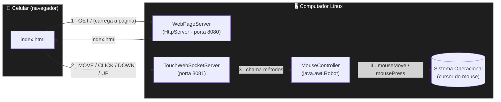

# Mouse Remote — Controle de Mouse via Smartphone

Aplicação desktop em **Java puro** que transforma qualquer smartphone (sem necessidade de instalar aplicativo) em um trackpad remoto para controlar o cursor do mouse de um computador Linux, através da rede Wi-Fi local.

O objetivo do projeto é demonstrar, de forma enxuta, a integração entre:
- Comunicação em tempo real via **WebSocket**;
- Manipulação de hardware/SO a partir de uma aplicação Java (`java.awt.Robot`);
- Um cliente web responsivo a eventos de toque (Touch Events API), sem frameworks.

---

## Sumário

- [Arquitetura](#arquitetura)
- [Fluxo de comunicação (WebSocket)](#fluxo-de-comunicação-websocket)
- [Tecnologias utilizadas](#tecnologias-utilizadas)
- [Estrutura do projeto](#estrutura-do-projeto)
- [Funcionalidades](#funcionalidades)
- [Segurança](#segurança)
- [Como executar](#como-executar)
- [Configuração](#configuração)
- [Limitações conhecidas / Troubleshooting](#limitações-conhecidas--troubleshooting)
- [Possíveis evoluções](#possíveis-evoluções)

---

## Arquitetura

A aplicação segue uma arquitetura **cliente-servidor** simples, com dois canais de comunicação distintos rodando no mesmo processo Java:

1. Um servidor **HTTP** (porta `8080`), responsável apenas por entregar a página estática (`index.html`) ao navegador do celular;
2. Um servidor **WebSocket** (porta `8081`), responsável por receber, em tempo real, os eventos de toque do celular e traduzi-los em comandos de mouse no sistema operacional.



**Por que dois servidores separados, em vez de um só?**
`com.sun.net.httpserver.HttpServer` (usado para servir o HTML) é um servidor **request-response** clássico — não é feito para conexões persistentes. Já o WebSocket exige uma conexão de longa duração, bidirecional, para permitir o envio contínuo de coordenadas em tempo real conforme o dedo se move na tela. Separar as responsabilidades em duas classes/portas mantém cada uma simples e evita gambiarras.

---

## Fluxo de comunicação (WebSocket)

O diagrama abaixo detalha o ciclo de vida de uma sessão de uso, incluindo o gesto de **arrastar com clique pressionado (drag)**, um dos recursos implementados na evolução do MVP:

```mermaid
sequenceDiagram
    autonumber
    participant U as Usuário (dedo)
    participant W as index.html (JS)
    participant S as TouchWebSocketServer
    participant R as MouseController (Robot)
    participant SO as Sistema Operacional

    U->>W: Abre o navegador e acessa http://IP:8080
    W->>S: Handshake WebSocket (ws://IP:8081)
    S-->>W: Conexão aceita (IP validado na allowlist)

    rect rgb(40, 40, 40)
    note over U,SO: Gesto: mover o cursor
    U->>W: touchmove (arrasta o dedo)
    W->>S: "MOVE:dx:dy"
    S->>R: moveRelative(dx, dy)
    R->>SO: mouseMove(x+dx, y+dy)
    end

    rect rgb(40, 40, 40)
    note over U,SO: Gesto: clique simples (tap rápido)
    U->>W: touchstart + touchend (sem mover)
    W->>S: "CLICK"
    S->>R: clickLeft()
    R->>SO: mousePress + mouseRelease
    end

    rect rgb(40, 40, 40)
    note over U,SO: Gesto: pressionar e arrastar (drag)
    U->>W: touchstart (segura parado ~350ms)
    W->>S: "DOWN"
    S->>R: pressLeft()
    R->>SO: mousePress (botão fica preso)
    U->>W: touchmove (arrasta com o botão pressionado)
    W->>S: "MOVE:dx:dy" (repetido)
    S->>R: moveRelative(dx, dy)
    U->>W: touchend (solta o dedo)
    W->>S: "UP"
    S->>R: releaseLeft()
    R->>SO: mouseRelease (solta o botão)
    end
```



O protocolo entre cliente e servidor é **texto puro, delimitado por `:`** (ex.: `MOVE:12:-4`), escolhido deliberadamente no lugar de JSON para eliminar a necessidade de uma biblioteca de serialização — mantendo a stack o mais enxuta possível.

---

## Tecnologias utilizadas

| Tecnologia | Papel no projeto | Observação |
|---|---|---|
| **Java 21** | Linguagem principal do backend | Uso de recursos nativos do JDK sempre que possível |
| **Gradle (Kotlin DSL)** | Build tool e gerenciador de dependências | `build.gradle.kts` |
| **`java.awt.Robot`** | Simula eventos de mouse no SO | Nativo do JDK, sem dependências |
| **`com.sun.net.httpserver.HttpServer`** | Servidor HTTP que entrega o `index.html` | Nativo do JDK |
| **[Java-WebSocket](https://github.com/TooTallNate/Java-WebSocket)** | Implementação do protocolo WebSocket (RFC 6455) | Única dependência externa do projeto |
| **HTML5 / CSS3** | Interface do cliente (trackpad virtual) | Sem frameworks |
| **JavaScript (Touch Events API)** | Captura dos gestos de toque e comunicação via WebSocket | Vanilla JS, sem libs |

---

## Estrutura do projeto

```
mouse-remote/
├── settings.gradle.kts
├── .gitignore
└── app/
    ├── build.gradle.kts
    └── src/main/
        ├── java/com/mentoria/mouseremote/
        │   ├── MainApp.java                 # Ponto de entrada; sobe os dois servidores
        │   ├── MouseController.java         # Abstrai o java.awt.Robot (mover/clicar)
        │   ├── TouchWebSocketServer.java     # Recebe comandos e valida IP de origem
        │   └── WebPageServer.java           # Serve o index.html via HTTP
        └── resources/
            ├── config.properties.example    # Modelo de configuração (IP permitido)
            └── web/
                └── index.html               # Cliente: trackpad virtual (HTML/CSS/JS)
```

---

## Funcionalidades

- ✅ Mover o cursor de forma **relativa** (modo trackpad), arrastando o dedo;
- ✅ **Clique esquerdo** simples via tap rápido;
- ✅ **Clicar e arrastar** (drag): pressionar e segurar o dedo ativa o "botão preso", permitindo arrastar itens/selecionar texto;
- ✅ **Sensibilidade configurável** via constante no cliente (`SENSIBILIDADE` em `index.html`);
- ✅ **Detecção automática do IP local** do servidor (ignorando interfaces virtuais de Docker/loopback), exibido no console ao iniciar;
- ✅ **Lista de IPs permitidos**, restringindo quem pode efetivamente controlar o mouse.

---

## Segurança

Por padrão, um servidor WebSocket sem autenticação aceitaria comandos de **qualquer dispositivo conectado à mesma rede**. Para mitigar esse risco, o projeto implementa:

1. **Allowlist de IP**: `TouchWebSocketServer` valida o IP de origem da conexão no `onOpen()` e encerra imediatamente (`conn.close()`) qualquer conexão vinda de um IP fora da lista permitida.
2. **Configuração fora do controle de versão**: o IP autorizado fica em `app/src/main/resources/config.properties`, arquivo **ignorado pelo Git** (ver `.gitignore`). Apenas um `config.properties.example`, sem dados reais, é versionado.

**Riscos residuais** (aceitos conscientemente neste MVP, dado o uso em rede doméstica confiável):
- A comunicação não é criptografada (`ws://`, não `wss://`) — em uma rede pública, o tráfego poderia ser inspecionado por terceiros;
- A validação por IP depende de o IP do celular ser estável; em redes com DHCP agressivo, o IP pode mudar e exigir atualização manual da allowlist;
- Não há autenticação por credencial/token — a evolução natural seria um PIN gerado dinamicamente no servidor.

---

## Como executar

### Pré-requisitos
- Linux com **servidor de display X11** (ver observação sobre Wayland abaixo);
- **JDK 21** instalado;
- **IntelliJ IDEA** (recomendado) — ele baixa o Gradle Wrapper e as dependências automaticamente;
- Celular e computador conectados à **mesma rede Wi-Fi**.

### Passos
1. Clone o repositório e abra a pasta `mouse-remote` no IntelliJ (`File > Open`);
2. Aguarde o IntelliJ sincronizar o Gradle (baixa a dependência `Java-WebSocket` automaticamente);
3. Copie `app/src/main/resources/config.properties.example` para `app/src/main/resources/config.properties` e informe o IP do seu celular (ver [Configuração](#configuração));
4. Execute a classe `MainApp` (▶️ no IntelliJ);
5. No console, anote o endereço exibido, por exemplo:
   ```
   http://192.168.x.x:8080
   ```
6. No navegador do celular, acesse esse endereço;
7. Arraste o dedo no retângulo para mover o cursor; toque rápido para clicar; segure e arraste para o modo drag.

---

## Configuração

`app/src/main/resources/config.properties`:

```properties
ip.permitido=<seu_ip_local_do_celular>
```

`app/src/main/resources/web/index.html` (constante no `<script>`):

```javascript
const SENSIBILIDADE = 3; // 1.0 = padrão. Aumente para o cursor responder mais rápido ao dedo.
```

---

## Limitações conhecidas / Troubleshooting

| Sintoma | Causa provável | Solução |
|---|---|---|
| Celular não abre a página | `MainApp` detectou um IP virtual (Docker/loopback) em vez do IP real da Wi-Fi | Rode `hostname -I` no PC e compare com o IP mostrado no console |
| `Address already in use` ao iniciar | Uma execução anterior do `MainApp` não foi encerrada | `sudo lsof -i :8081`, depois `kill -9 <PID>` |
| Acentos quebrados no console (`P�gina`) | Encoding do console do Gradle diferente de UTF-8 | Definir `jvmArgs` com `-Dfile.encoding=UTF-8` na task `run` do `build.gradle.kts` |
| Cursor não se move mesmo com WebSocket conectado | Sessão gráfica em **Wayland** (em vez de X11) bloqueando `java.awt.Robot` por segurança | Verificar com `echo $XDG_SESSION_TYPE`; se `wayland`, considerar sessão X11 ou uma alternativa como `ydotool` |

---

## Possíveis evoluções

- Autenticação via **PIN/token** gerado dinamicamente, eliminando a dependência de IP fixo;
- Criptografia da conexão (`wss://`) com certificado autoassinado;
- Suporte a **clique direito** e **scroll** (dois dedos);
- Reconexão automática do WebSocket em caso de queda de sinal;
- Interface do cliente com **PWA** (ícone na tela inicial, modo tela cheia nativo).

---

## Autor

Projeto desenvolvido como estudo de comunicação em tempo real (WebSocket) e integração Java com APIs do sistema operacional.
